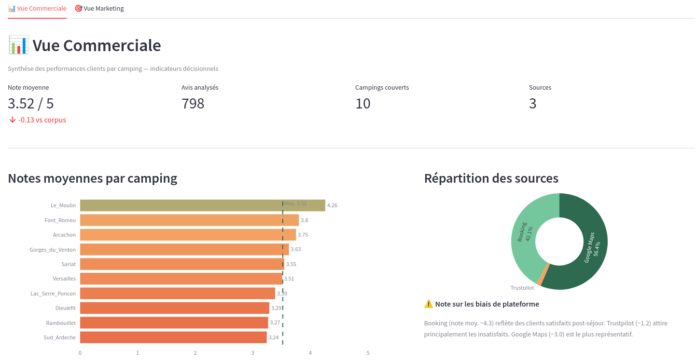
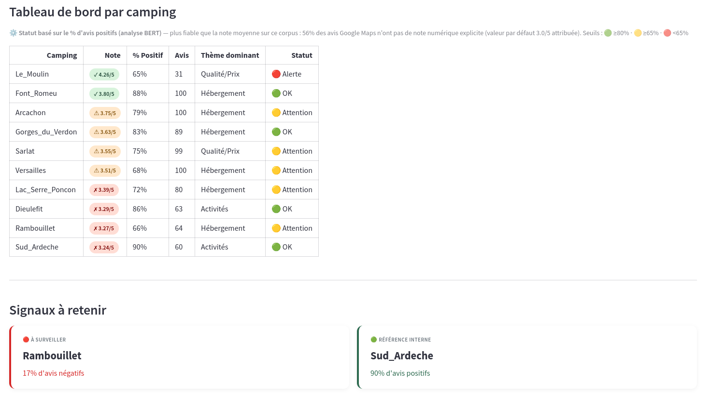
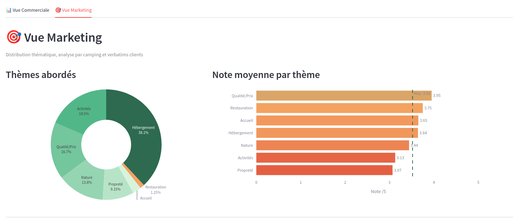
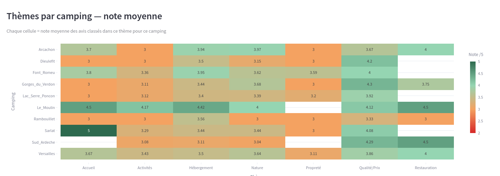
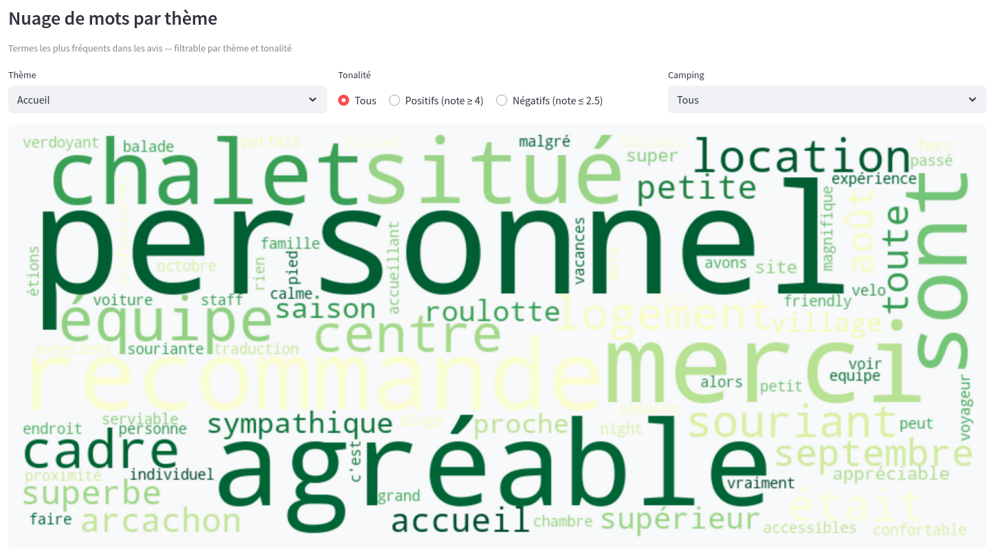
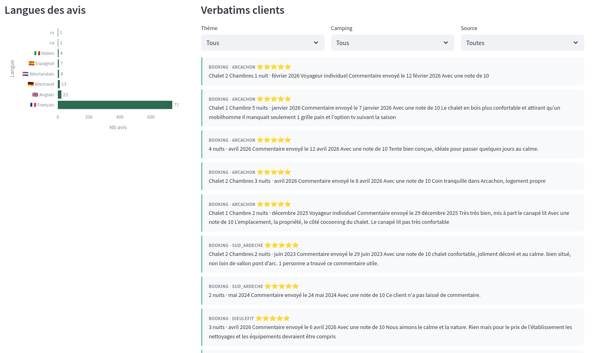

# 🏕️ Huttopia — Voice of Customer

[](https://www.python.org/)
[](https://streamlit.io/)
[](https://huggingface.co/)
[](https://claude.ai/)

---

## Contexte business

Huttopia positionne ses campings-nature sur un segment premium avec une promesse d'expérience authentique en pleine nature. Pour une équipe Commercial & Marketing, la question n'est pas "combien d'étoiles ?" mais **"où se situe l'écart entre la promesse et l'expérience vécue, et que faire en priorité ?"**

Ce projet analyse 798 avis clients collectés sur Booking, Google Maps et Trustpilot pour répondre à cette question avec des données concrètes.

---

## Questions business

1. Le positionnement qualité/prix premium est-il perçu positivement par les clients ?
2. Quels sont les irritants principaux qui dégradent la satisfaction ?
3. Quels campings nécessitent une attention prioritaire ?

---

## 🖥️ Dashboard

**Vue Commerciale — KPIs et notes par camping**



**Vue Marketing — Thèmes et heatmap**



**Vue Marketing — Nuage de mots et verbatims**



---

## Insights & Recommandations

### 1. ✅ Le positionnement premium est validé par les clients

**Constat :** Le rapport qualité-prix est le thème le mieux noté du corpus (3.95/5 sur 133 avis). 68% des avis sur ce thème sont positifs (≥4/5). Seulement 4 avis sur 133 (3%) sont franchement négatifs — et ils portent sur la politique d'annulation, pas sur le prix.

**Insight :** Le prix premium est accepté. Les clients qui séjournent chez Huttopia comprennent et valident le positionnement. L'hébergement (3.64/5 sur 304 avis, soit 38% du corpus) confirme que le produit core tient ses promesses.

**Recommandation :** Intégrer le Rapport Qualité/Prix comme KPI stratégique dans le reporting commercial mensuel. Seuil d'alerte à définir à 3.5/5 — toute dégradation signal une remise en cause du positionnement premium à investiguer immédiatement.

---

### 2. ⚠️ La propreté est l'irritant le plus systématique

**Constat :** Propreté est le thème le moins bien noté du corpus (3.07/5 sur 73 avis), sous la moyenne globale (3.52/5) sur la quasi-totalité des campings. C'est le seul thème où aucun camping ne dépasse 3.6/5 (hors Font Romeu à 3.59/5).

**Campings les plus concernés :**

| Camping | Note Propreté | Note globale |
|---|---|---|
| Rambouillet | 3.00 / 5 ⚠️ | 3.27 / 5 🔴 |
| Arcachon | 3.00 / 5 ⚠️ | 3.75 / 5 🟡 |
| Gorges du Verdon | 3.00 / 5 ⚠️ | 3.63 / 5 🟡 |
| Sarlat | 3.00 / 5 ⚠️ | 3.55 / 5 🟡 |
| Versailles | 3.11 / 5 | 3.51 / 5 🟡 |
| Font Romeu | 3.59 / 5 | 3.80 / 5 🟢 |

> ⚠️ Les notes à 3.00/5 correspondent principalement à des avis Google Maps sans note numérique explicite (valeur par défaut attribuée). Le signal est à confirmer par une lecture des verbatims plutôt que par la note seule.

**Recommandation :** Audit terrain sanitaires sur les 5 campings dont la note Propreté est ≤3.0/5 pour identifier les causes racines (fréquence de nettoyage, vétusté des installations, dimensionnement par rapport à la fréquentation). Font Romeu (3.59/5) peut servir de référence interne.

**Impact estimé :** La propreté est un facteur hygiénique — son absence génère des avis négatifs, son amélioration ne génère pas d'avis enthousiastes mais supprime un frein majeur à la recommandation.

---

### 3. ⚠️ Les activités sont un levier de différenciation sous-exploité

**Constat :** Activités est le 2ème thème le moins bien noté (3.13/5 sur 148 avis, soit 18.5% du corpus). C'est un volume significatif — les clients en parlent beaucoup mais les notes restent basses sur la plupart des campings.

**Campings les plus concernés :**

| Camping | Note Activités | Note globale |
|---|---|---|
| Dieulefit | 3.00 / 5 ⚠️ | 3.29 / 5 🔴 |
| Rambouillet | 3.00 / 5 ⚠️ | 3.27 / 5 🔴 |
| Arcachon | 3.00 / 5 ⚠️ | 3.75 / 5 🟡 |
| Sud Ardèche | 3.08 / 5 | 3.24 / 5 🔴 |

> ⚠️ Même réserve que pour la Propreté : les notes à 3.00/5 sont à confirmer par lecture des verbatims — elles peuvent refléter le fallback Google Maps plutôt qu'une vraie évaluation des activités.

**Référence interne :** Le Moulin (4.17/5 sur Activités) et Font Romeu (3.36/5) surperforment — leurs pratiques méritent d'être documentées.

**Recommandation :** Analyser qualitativement les verbatims Activités sur les campings en alerte pour identifier si le problème est l'offre elle-même (manque d'animations) ou sa communication (clients qui ne trouvent pas ce qui existe). Ces deux causes n'ont pas le même coût de résolution.

---

### 4. 🔴 Quatre campings nécessitent une attention prioritaire

Les campings suivants cumulent une note globale inférieure à 3.4/5 — sous le seuil d'alerte — avec des faiblesses sur plusieurs thèmes simultanément :

| Camping | Note globale | Point faible principal |
|---|---|---|
| Sud Ardèche | 3.24 / 5 | Activités (3.08/5) |
| Rambouillet | 3.27 / 5 | Propreté (3.00/5) + Activités (3.00/5) |
| Dieulefit | 3.29 / 5 | Activités (3.00/5) |
| Lac Serre-Ponçon | 3.39 / 5 | Activités (3.12/5) |

**Rambouillet est le cas le plus préoccupant** — seul camping avec deux thèmes à 3.00/5 simultanément (Propreté et Activités).

---

## Corpus & Méthodologie

**798 avis · 10 campings · 3 sources · 6 langues détectées**

| Source | Avis | Note moyenne |
|---|---|---|
| Google Maps | 450 (56%) | 3.00 / 5 |
| Booking | 336 (42%) | 4.30 / 5 |
| Trustpilot | 12 (2%) | 1.25 / 5 |

> ⚠️ **Biais de plateforme :** l'écart entre sources est réel et attendu. Booking filtre des clients vérifiés post-séjour. Trustpilot concentre les insatisfaits. Google Maps est la source la plus représentative de la satisfaction réelle.

**Classification thématique :** BART zero-shot (`facebook/bart-large-mnli`), labels passés en anglais pour de meilleures performances sur texte français, 7 thèmes. Précision validée manuellement sur 20 avis : ~85%.

---

## Limites méthodologiques

- **Corpus partiel :** 798 avis sur 10 campings (sur 56+ sites Huttopia France). Les insights sont indicatifs, à confirmer sur un corpus élargi.
- **TripAdvisor non inclus :** protection anti-bot trop agressive, source abandonnée après tentative avec Scrapling.
- **Dates manquantes :** 90% des avis Google Maps sans date — aucune analyse temporelle possible sur cette source.
- **Notes Google Maps :** les avis sans note numérique reçoivent une valeur par défaut (3.0/5) — les moyennes Google sont à interpréter avec précaution.
- **Précision classification ~85% :** le modèle sur-classe en "Hébergement" sur les avis multi-thèmes.

---

## Stack technique

| Composant | Technologie |
|---|---|
| Collecte | Selenium, Scrapling (StealthyFetcher) |
| Traitement | pandas, langdetect |
| Classification thématique | `facebook/bart-large-mnli` (zero-shot) |
| Dashboard | Streamlit + Plotly |

```bash
# Installation
git clone https://github.com/TON_USERNAME/huttopia-voc.git
cd huttopia-voc
pip install -r requirements.txt

# Lancer le dashboard
streamlit run dashboard/app.py
```

---

## Collaboration avec Claude (Anthropic)

Ce projet a été développé en collaboration active avec **Claude Sonnet** (Anthropic).

La rédaction des scripts Python a été déléguée à Claude : scrapers, pipeline de nettoyage, classification thématique, dashboard. La direction analytique, les choix méthodologiques, la validation des résultats ML et la formulation des insights restent de ma responsabilité. Chaque script a été testé et validé sur les données réelles.

Utiliser un assistant IA pour accélérer la production de code est une compétence à part entière — savoir formuler le bon problème, valider les outputs et garder la maîtrise analytique est précisément ce qu'un Business Analyst fait avec une équipe data.

---

## Auteur

Projet réalisé dans le cadre d'une candidature au poste **Business Analyst Commercial & Marketing** chez Huttopia.

*Analyse réalisée sur données publiques (avis Booking, Google Maps, Trustpilot) dans le cadre d'une candidature. Les conclusions reflètent une analyse externe et ne constituent pas un positionnement officiel d'Huttopia.*
